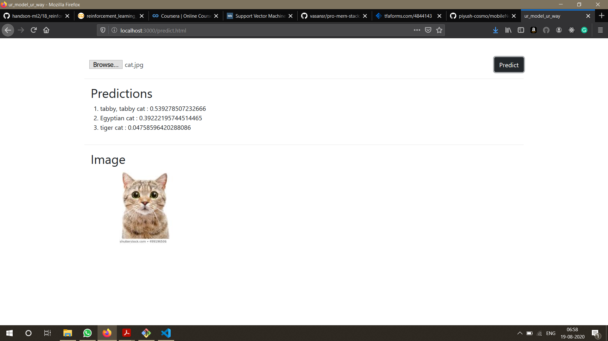

# Image Classification On Browser

This project is for the sole purpose of "Integrating ML with Web". Bringing together the power of Machine Learning model and Node js to see what actually the model does in jupyter notebook or google colaboratory.

This is the one to see the predictions on screen made on classifying the image to it's respective classes. We can see both the **classes** & **probabilities**.

## REQUIREMENTS

###### node js

Node.js is an open-source, cross-platform, JavaScript run-time environment that executes JavaScript code outside of a browser, built on Chrome's V8 JavaScript engine.

###### Tensorflow Js

TensorFlow.js, an open-source library we can use to define, train, and run machine learning models entirely in the browser, using JavaScript and a high-level layers API.

###### MobileNet Model

MobileNets are small, low-latency, low-power models parameterized to meet the resource constraints of a variety of use cases.i.e., classification, segmentation, detection etc.

## Installing node and npm

[node](https://nodejs.org/en/)

[npm install](https://docs.npmjs.com/cli/install)

## Project directory and npm init

1.Go to your local directory and make a new folder as mobileNet_node_Browser(You can give any name to it).

2.Open your favourite code editor(in my case, i opened my vscode).

3.Make a local folder server with **mkdir server** in your terminal.

4.**cd server/** - In your terminal, write this to get inside server folder.

5.**npm init -y** - This will create a package.json file where all the dependencies of project exists.

###### package.json

```
{
  "name": "server",
  "version": "1.0.0",
  "description": "",
  "main": "index.js",
  "scripts": {
    "test": "echo \"Error: no test specified\" && exit 1"
  },
  "keywords": [],
  "author": "",
  "license": "ISC",
}
```

## Installing the libraries

**npm install express bootstrap jQuery popper.js --save** - in your terminal type this.

###### Bootstrap | jQuery | popper.js

These libraries are needed for the view part of web page.

###### Express

This library is needed as this is a minimal and flexible Node.js web application framework and will help me in building a static server to run html files and other supporting files like css/js.

###### changes in code 

**package.json**

```
{
  "name": "server",
  "version": "1.0.0",
  "description": "",
  "main": "index.js",
  "scripts": {
    "test": "echo \"Error: no test specified\" && exit 1"
  },
  "keywords": [],
  "author": "",
  "license": "ISC",
  "dependencies": {
    "bootstrap": "^4.5.1",
    "express": "^4.17.1",
    "jquery": "^3.5.1",
    "popper.js": "^1.16.1"
  }
}
```

***NOTE*** - On installing these libraries, package-lock.json file is also created which contains all the information about the packages installed.

## Setting up the server

In your terminal, type **touch server.js** to create a file named as server.js. Type some code in there to build the server with express.

**server.js**

```
const express = require('express');
const app = express();

app.use(express.static("../static"));

app.listen(3000, function() {
    console.log("server running on port 3000");
})
```

## Setting up the static files

1.In your terminal, type **cd ..** to go back one level to root directory i.e., mobileNet_node_Browser.

2.In your terminal, type **mkdir static** to make a static folder in the root directory.

3.In your terminal, type **cd static/** to go to static folder.

4.In your terminal, type **touch predict.html** to make a file named as predict.html.

**predict.html** - This will contain all the basic html form part, Bootstrap is used to make it look cooler. Tensorflow js and MobileNet model is imported in to this file.

```
<!DOCTYPE html>
<html>
    <head>
        <meta charset="utf-8">
        <meta name="viewport" content="width=device-width, initial-scale=1, shrink-to-fit=no">
        <meta http-equiv="x-ua-compatible" content="ie=edge">

        <link rel="stylesheet" href="files/bootstrap.min.css">

        

        <title>ur_model_ur_way</title>
    </head>
    <body>
        
        <main>
            <div class="container mt-5">
                <div class="row">
                    <div class="col-12">
                        <div class="progress progress-bar progress-bar-striped progress-bar-animated mb-2">Loading Model</div>
                    </div>
                </div>
                <div class="row">
                    <div class="col-6">
                        <input id="image-selector" class="form-control border-0" type="file">
                    </div>
                    <div class="col-6">
                        <button id="predict-button" class="btn btn-dark float-right">Predict</button>
                    </div>
                </div>
                <hr>
                <div class="row">
                    <div class="col">
                        <!-- <p id="prediction"></p>
                        <br> -->
                        <h2 class="ml-3">Predictions</h2>
                        <ol id="prediction-list"></ol>
                    </div>
                </div>
                <hr>
                <div class="row">
                    <div class="col-12">
                        <h2 class="ml-3">Image</h2>
                        
                    </div>
                </div>
            </div>
        </main>
        <script src="files/jquery.slim.min.js"></script>
        <script src="files/popper.min.js"></script>
        <script src="files/bootstrap.min.js"></script>

        <!-- <script src="files/@tensorflow/tfjs/dist/tf.min.js"></script>
        <script src="files/@tensorflow/tfjs/dist/tf.node.js"></script>
        <script src="files/@tensorflow/tfjs-node"></script>
        <script src="https://cdn.jsdelivr.net/npm/@tensorflow/tfjs/dist/tf.min.js"></script> -->

        <script src="https://cdn.jsdelivr.net/npm/@tensorflow/tfjs@1.0.1"> </script>
        <script src="https://cdn.jsdelivr.net/npm/@tensorflow-models/mobilenet@1.0.0"> </script>

        <!-- <script src="imagenet_classes.js"></script> -->
        
        <!-- <script src="predict.js"></script> -->
        <script src="classify.js"></script>
    </body>
</html>
```

5.In your terminal, type **touch classify.js** to make a file named as classify.js.

**classify.js** - This contains all the necessary logic to load the model in the browser with the use of "Tensorflow Js" and async/await function to load it asynchronously, select the image and get the prediction of that image.

```
$("#image-selector").change(function () {
    let reader = new FileReader();
    reader.onload = function () {
        let dataURL = reader.result;
        $('#selected-image').attr("src", dataURL);
        $("#prediction-list").empty();
    }
    let file = $("#image-selector").prop('files')[0];
    reader.readAsDataURL(file);
});

// let handler;
let model;
(async function() {
    // handler = tfnode.io.fileSystem('uploads/model.json');
    model = await mobilenet.load();
    $('.progress-bar').hide();
})();

$("#predict-button").click(async function () {
    let image = $('#selected-image').get(0);
    // let tensor = tf.browser.fromPixels(image)
    //     .resizeNearestNeighbor([224,224])
    //     .toFloat()
    //     .expandDims();


    let predictions = await model.classify(image);
    // let top5 = Array.from(predictions)
    //     .map(function (p, i) {
    //         return {
    //             probability: p,
    //             className: IMAGENET_CLASSES[i]
    //         };
    //     }).sort(function (a, b) {
    //         return b.probability - a.probability;
    //     }).slice(0, 5);

    // $("#prediction").innerHTML = "MobileNet prediction <br><b>" + top5[0].className + "</b>";

    $("#prediction-list").empty();
    // top5.forEach(function (p) {
    //     $('#prediction-list').append(`<li>${predictions}</li>`);
    // });

    for(var i=0;i<3;i++) {
        $('#prediction-list').append(`<li>${predictions[i].className} : ${predictions[i].probability}</li>`);
    }
});
```

**files** - This contains some files included in html to render the viewpage.

## Working

1.In your terminal, type **cd ..** to go back one level to root directory i.e., mobileNet_node_Browser.

2.In your terminal, type **cd server/** to go to server folder.

3.In your terminal, type **npm start** to run the server. It starts running on port 3000.

4.Go to your browser, type in **https://localhost:3000/** to render the webpage.

5.As the webpage gets rendered, the **mobileNet** model starts loading on the browser with a progress bar displaying that it is getting loaded. When the progress bar disappears, it means that model has been loaded. 

6.Click on **browse** button to select the image to see the predictions. Opening this, the selected image will be displayed on browser.

7.Click on **predict** button to see the actual predictions(**classname** & **probability**).

## DEMO


